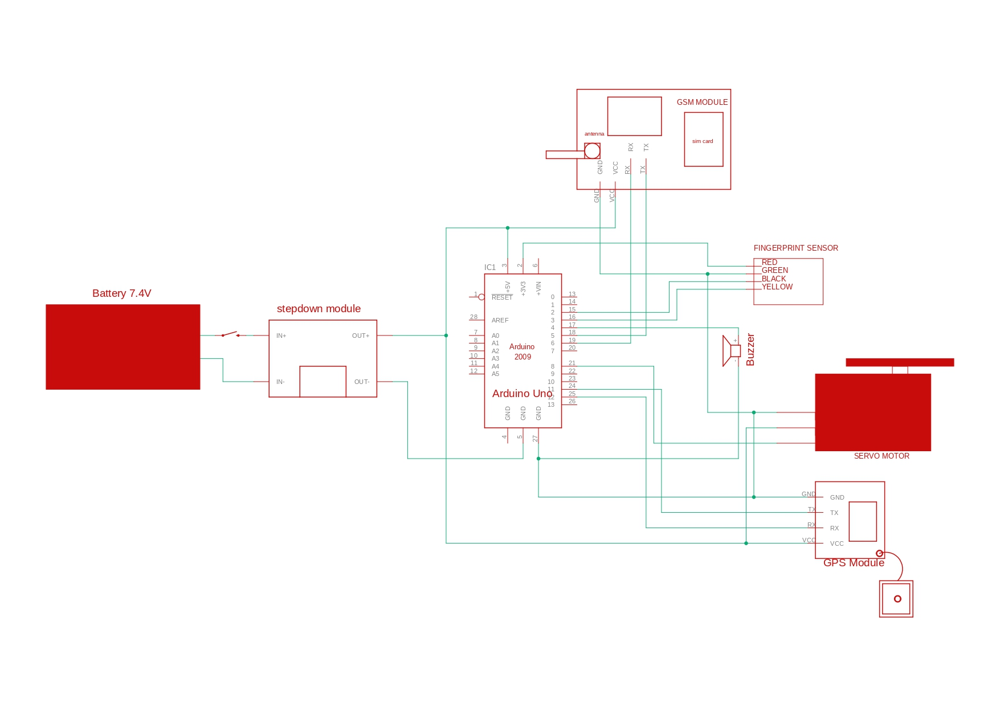

# Anti-Theft Fingerprint Bag Lock with GPS and GSM Module

## Table of Contents

- [Introduction](#introduction)
- [Features](#features)
- [Components](#components)
- [Installation](#installation)
- [Usage](#usage)
- [Contributing](#contributing)
- [License](#license)

## Introduction

This project implements an anti-theft system using a fingerprint scanner, GPS module, and GSM module to protect a bag or backpack. The system allows authorized users to unlock the bag using their fingerprints while sending GPS coordinates to a predefined number in case of unauthorized access.

## Features

- Fingerprint authentication for bag unlocking.
- GPS module to track the bag's location.
- GSM module to send SMS alerts with GPS coordinates in case of unauthorized access.
- Simple servo mechanism to lock and unlock the bag.

## Components

- Arduino board (e.g., Arduino Uno, Arduino Mega)
- Fingerprint scanner (Adafruit Fingerprint Sensor)
- GPS module (e.g., Ublox NEO-6M)
- GSM module (e.g., SIM900)
- Servo motor
- Buzzer
- Various resistors, wires, and connectors

## Installation

1. Clone this repository: `git clone https://github.com/your-username/your-repo.git`
2. Connect the components according to the circuit diagram.
3. Upload the provided code to your Arduino board using the Arduino IDE.

## Usage

1. Power on the system.
2. Enroll authorized fingerprints using the fingerprint scanner.
3. Close the bag and lock it.
4. To unlock the bag, place an authorized fingerprint on the scanner.
5. In case of unauthorized access, the system will activate the GPS module to obtain coordinates and send an SMS with the location to the predefined number.

## Contributing

Contributions are welcome! If you find any issues or have suggestions for improvements, please open an issue or create a pull request. When contributing, please follow the existing code style and guidelines.

1. Fork the repository.
2. Create a new branch for your feature/bugfix: `git checkout -b feature-name`
3. Make your changes and commit them: `git commit -m "Description of changes"`
4. Push to the branch: `git push origin feature-name`
5. Open a pull request explaining your changes.

## License

This project is licensed under the [MIT License](LICENSE).

---

Feel free to customize the above template to fit your project's specifics. Make sure to replace placeholders like `your-username`, `your-repo`, and `url_to_project_image` with actual values. A good README provides clear instructions, explains the purpose and functionality of your project, and invites others to contribute.

